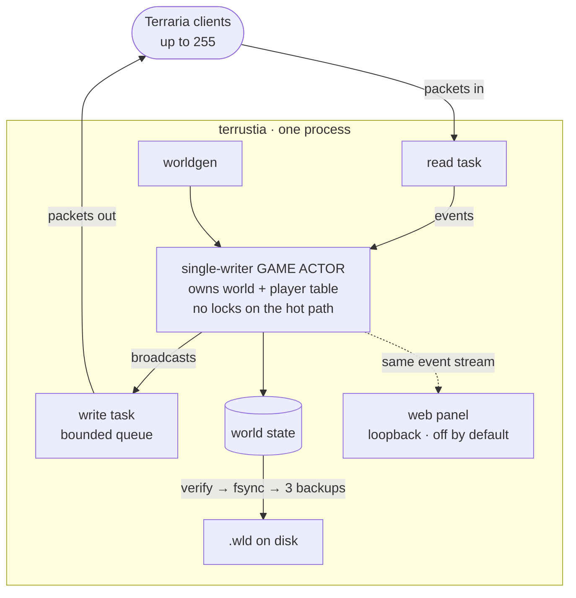

<div align="center">


<br>

[](https://github.com/bybrooklyn/terrustia/actions/workflows/ci.yml)
[](LICENSE)
[](crates/terrustia-proto/LICENSE)


**A Terraria 1.4.5.8 dedicated server, written from scratch in Rust.**
Real clients connect to it, and the worlds they play are ordinary Terraria worlds.

[Quickstart](#quickstart) ·
[Running](#running) ·
[Hosting](#hosting-and-setup) ·
[How it fits together](#how-it-fits-together) ·
[What works](#what-works) ·
[What the audits found](#what-the-audits-found) ·
[Verification](#verification) ·
[Contributing](CONTRIBUTING.md)

</div>

---

> [!NOTE]
> Terraria is a trademark of Re-Logic. This is an independent reimplementation of the **dedicated
> server**, not affiliated with, endorsed by, or supported by Re-Logic. You need a copy of the game
> to play. This replaces the server, not the game.

## Quickstart

What it does best today is serve a world you already have:

```sh
terrustia --world path/to/World.wld
```

Your world file, your clients, nothing else to install. Point it at nothing and it generates a fresh
world, saves it into a `worlds/` directory in the folder you ran it from, and serves that, the way a
Minecraft server lays out its own files wherever it is started. Measured against the official server
on the same 4200×1200 world with nobody connected:

| | vanilla 1.4.5.8 | terrustia | |
|---|:---:|:---:|:---:|
| Startup | 2.26 s | **0.06 s** | 37× faster |
| CPU, idle | 104% of a core | **0.7%** | ~150× less |
| RAM, idle | 641.8 MB | **45.4 MB** | 14× less |
| Bandwidth over 5 minutes | 148,874 B | **133,400 B** | 10% less |

Saves are verified before they replace anything, then fsynced, and three backups are kept in
rotation. A crash partway through a write cannot destroy the previous save. The file header is
preserved byte for byte and patched, so everything the header holds that this server does not model
survives untouched. The sections that carry live state (Journey research, pylon rooms, tile
entities) are re-encoded from the running server rather than copied, which is what keeps a pylon
placed this session from vanishing. The bestiary is the exception and it is a real loss: see the
World files table below.

The short version: point it at a `.wld` you already have and it serves it well, with the same
clients, the same file, and a much lighter footprint than the official server. Point it at nothing
and it generates a world that is playable, decorated, settled and smoothed: forests, a green jungle,
cacti, lakes, settled water, pots, statues, piles, fallen logs, traps, rounded terrain, floating
islands, spider and gem caves, pyramids, living trees, jungle shrines, underground cabins, an oasis,
the glowing mushroom biome, and the full cosmetic and cleanup tail. Vanilla's seven secret seeds,
plus two more real ones an earlier pass had missed, are detected by their real magic strings (`--seed
"getfixedboi"` is recognised, though a world this generator makes does not claim the flag, since
nothing here mirrors the world), and one of the nine, No Traps World, is fully wired. What is left
of worldgen is 4 of 15 micro-biome classes and the other eight seeds' own generation-content
differences, sized in [`TODO.md`](TODO.md)'s v0.0.2 section and deferred to v0.0.2.

## Running

```sh
cargo run --release -- --world path/to/World.wld     # serve a world you already have
cargo run --release -- --listen 127.0.0.1:7777 --world path/to/World.wld
cargo run --release                                  # generate one into worlds/ and serve it
cargo run --release -- --new "My World"              # generate a named world into worlds/
cargo run --release -- --save /some/where.wld        # generate one at an explicit path instead
cargo run --release -- --record capture.trcap        # record every byte, for docs/real-client.md
```

Worlds live in a `worlds/` directory next to wherever the server runs, and `--worlds` lists them.
They are saved on shutdown, every `autosave_secs`, and on `/save`. A world loaded from an explicit
path saves back over itself; `--save` writes somewhere else. A `--world <name>` (rather than a path)
is looked up in `worlds/` first, then in your own Terraria folder, so a world you already own is
still servable by name.

Then in Terraria: **Multiplayer → Join via IP → `127.0.0.1`**, port `7777`.

Configuration is optional. A `terrustia.toml` in the working directory overrides the defaults; see
`terrustia.toml.example`. `TERRUSTIA_LOG=debug` raises the log level.

## Hosting and setup

There is no single blessed path. Docker, a native binary behind systemd, and OS packages (Homebrew,
winget, AUR) are all documented and supported equally; see [Packaging](#packaging) below.

- **`terrustia --setup`** runs a short interactive wizard (dedicated directory, world name, max
  players, whether to turn the web panel on) and starts the server with what it wrote. It also runs
  automatically on a first, zero-flag launch when the working directory is the same directory the
  executable itself is in and nothing terrustia-shaped is there yet, which is the shape a raw binary
  double-clicked out of a downloads folder actually has. Plain `terrustia` with no flags, run from
  anywhere else, is unchanged: still the non-interactive "generate a world and serve it." The
  wizard's dedicated directory is refused if anything is already in it.
- **Environment variables** configure everything a `terrustia.toml` can, for Docker and automation
  use where there is often no shell around the process to pass a flag and no volume mount to put a
  file on: `TERRUSTIA_LISTEN`, `TERRUSTIA_MAX_PLAYERS`, `TERRUSTIA_WORLD_NAME`,
  `TERRUSTIA_PANEL_ENABLED`, and so on. Every key in `terrustia.toml.example` has a
  `TERRUSTIA_<UPPERCASE_KEY>` equivalent. Precedence is defaults, then `terrustia.toml`, then
  environment, then an explicit CLI flag.
- **UPnP**: on startup, terrustia asks the router to forward the game port automatically. When no
  UPnP-capable router answers, or it refuses, this logs a specific fallback message naming the port
  and the local address to forward it to by hand. It is never a fatal error. Set `upnp_enabled =
  false` to turn it off. This has nothing to do with the web panel, which stays bound to loopback
  regardless. The IGD protocol is hand-rolled (`upnp.rs`), and its parsing is tested against
  captured output from real routers, but the **live socket path has not yet been verified against a
  real router**: no CI runner has one to answer with. `cargo run --example upnp_probe` is the tool
  for closing that on a real home network, and until someone has, treat the automatic mapping as
  the convenience and the fallback message as the contract.
- **`terrustia update`**: on boot, terrustia checks GitHub for a newer, signature-verified release
  and says so, in the console log and as an in-game notice to the first recognised admin who signs
  in afterward. Applying it is a separate, deliberate step: run `terrustia update` yourself. It
  shells out to the real `cosign` binary, checking the same keyless GitHub Actions signing chain
  `release.yml` signs with, so there is no separate trust root.

### Packaging

| Target | Where | Status |
|---|---|---|
| Homebrew | `packaging/homebrew/terrustia.rb` | Builds from source with `cargo install`. `brew style` clean; verified with a real `cargo install --path` build. `brew audit` and `--build-from-source` could not run in this environment (its Xcode CLT is below Homebrew's required minimum) |
| systemd | `packaging/terrustia.service` | Verified by running the unit's literal `ExecStart` and sending it the exact `SIGTERM` its `KillSignal` names, which is how a real shutdown deadlock was found and fixed (see [What the audits found](#what-the-audits-found)) |
| Docker | `Dockerfile`, `.github/workflows/docker.yml` | Multi-arch image, cosign-signed, smoke-tested serving with no config. `HEALTHCHECK` present |
| winget | `packaging/winget/manifests/…` | Validated against the current (1.12.0) `microsoft/winget-cli` schemas; all three manifests pass structurally. Publishing needs a PR into `microsoft/winget-pkgs` |
| AUR | `packaging/aur/PKGBUILD` | Builds from source, matches Arch's Rust packaging guidelines, `shellcheck`-clean. `makepkg` and `namcap` need a real Arch environment. Publishing needs an AUR account |

Every `url` or checksum above that points at a `v0.0.1` release asset is a disclosed placeholder;
that tag does not exist yet (see [`TODO.md`](TODO.md)).

---

## How it fits together

Three crates. `terrustia-proto` is the wire format with no I/O: primitives, packets, tile-section
coding, and the tile, NPC and housing tables extracted from the game. Because it does no I/O, every
packet round-trips in a unit test without a socket. `terrustia-client` is a headless client that
speaks the protocol a real client speaks, so the same code drives integration tests, probes a real
`TerrariaServer` for comparison, or runs as a bot. `terrustia` is the async server.

The server is a single-writer actor. One task owns the world and the player table, so there are no
locks on the hot path and packet ordering is deterministic. Each connection gets a read task that
feeds that actor and a write task draining a bounded queue. The web panel, when it is on, taps the
same event stream the terminal prints, rather than keeping a second path of its own.



### How this was derived

Terraria 1.4.5 changed the protocol, and at the time of writing no public documentation covers it.
The community references, and the existing Rust crates, all describe 1.4.4.9 (release 279).
Everything here was transcribed from the shipped `TerrariaServer.exe`, decompiled with `ilspycmd`.
`docs/protocol-notes.md` records the findings in our own words. No decompiled game code is checked
into this repository.

Differences from 1.4.4 that matter, and that stale documentation gets wrong:

- The handshake string is `Terraria325`.
- Packet `3` carries a trailing bool after the player slot.
- Tile sections are a bare DEFLATE stream with no leading "is compressed" flag byte.
- `WorldData` has eleven world-flag bytes and a trailing extra-spawn-point list.
- The server still pushes sections as players move, once a tick, from each player's own position.
  Packet `159` is a client-side repair for a section it finds missing, not the streaming path, and
  documentation that calls it the streaming path is wrong.

## What works

The honest answer, feature by feature. It was built from audits run against the code rather than
against these notes. [`AUDIT.md`](AUDIT.md) has the findings behind it, and
[What the audits found](#what-the-audits-found) below tells the ones worth telling.

| | Meaning |
|:---:|---|
| ✅ | Implemented, and checked |
| 🟡 | Works, with the limitation named in the row |
| 🔴 | Not implemented. A player will notice |
| ⬜ | Deliberately out of scope, with the reason |

<details>
<summary><b>Protocol and connectivity</b></summary>

| | Feature | Notes |
|---|---|---|
| ✅ | Protocol release 326 (1.4.5.8) | Release 325 accepted too. They differ in the announced number and four bytes of packet 7 |
| ✅ | Handshake, world data, section streaming | Checked against a real `TerrariaServer`, not only against our own client |
| ✅ | Server password | |
| ✅ | Localized announcements | Keys with substitutions, as the game sends, so a non-English client reads its own language |
| 🟡 | Packet coverage | 111 of 163 message ids handled. Most of the rest are outbound-only or dead in vanilla too. Genuinely missing, per `tools/packet_audit.py`'s own count: portal-gunning an NPC (100), shop overrides (104), and the dead-player fade cue (135). Spectating (150) is host migration and does not apply to a dedicated server |
| ⬜ | Steam P2P and lobbies | Steamworks' licence is incompatible with AGPL |
| ⬜ | Encryption | Terraria's protocol has none. `/login` sends a password as ordinary chat text, so do not reuse a real one |

</details>

<details>
<summary><b>World files</b></summary>

| | Feature | Notes |
|---|---|---|
| ✅ | Load `.wld` (format 279 to 326) | Refuses older and newer by name rather than guessing |
| ✅ | Save `.wld` | Header preserved byte for byte and patched, so state we do not model survives untouched |
| ✅ | Journey research, pylon rooms, tile entities | Re-encoded from the server's own live state, not copied from the loaded bytes. It has to be: a pylon placed while the server ran is not in the bytes it opened, and one that was mined still is (`wld_save.rs:124-152`) |
| ✅ | Held pressure plates | Written empty, which is the correct minimum rather than a gap: vanilla's own loader throws the pressed set away on every load too (`wld_save.rs:538-550`) |
| ✅ | Verified before replacing, fsynced, 3 rotating backups | So a crash mid-write cannot leave a corrupt file in place of a good one |
| ✅ | `--new <name>` | Generates a fresh world into the world directory, under vanilla's own space-to-underscore filename convention. Refuses rather than overwrites if that name is taken |
| 🔴 | Bestiary | **Not preserved.** This server keeps no kill/sighting/chat tracker, so the section is written empty on every save and a world opened here loses the bestiary progress it arrived with. Deliberate and reasoned at `wld_save.rs:576-584` (carrying the bytes forward would claim progress the server cannot keep in step with), but a player will notice |
| ✅ | In-progress blood moon or eclipse | Read on load and patched back on save, so an event survives a restart (`wld.rs:1028-1033`) |

</details>

<details>
<summary><b>World generation</b></summary>

Tier 1 (the passes that make a world stop looking like a prototype), Tier 2 (biome set pieces) and
Tier 3 (the cosmetic and cleanup tail) are all done. What is left: 4 of 15 real `MicroBiome`
classes, and eight of the nine known secret seeds' own generation-content differences (the ninth, No
Traps World, is done).

The Enchanted Sword shrine closed the ninth class, and it is the first built on a real transcription
of vanilla's own shape/modifier/action generation pipeline (`worldgen/genpipe.rs`) rather than on
plain circles. That pipeline is the shared dependency five of the remaining six classes need, so it
is the reason the count can move again.

| | Feature | Notes |
|---|---|---|
| ✅ | Terrain, caves, ore veins | |
| ✅ | Dungeon, hive, underworld, evil chasms | Our own algorithms, not vanilla's |
| ✅ | Jungle temple, **including the Lihzahrd Altar** | Its absence once made Golem unreachable in every generated world; see [What the audits found](#what-the-audits-found) |
| ✅ | Demon and crimson altars, life crystals, shadow orbs | Enough to be beatable |
| ✅ | Chests | Depth-tiered everywhere, with vanilla's own jungle and underground-desert item lists where the biome matches |
| ✅ | **Trees** | Frames transcribed from `WorldGen.GrowTree`: trunk, branches, roots, canopy |
| ✅ | Vines and jungle grass | The underground jungle's mud is lined with grass, which is what vines hang from |
| ✅ | Cacti | |
| ✅ | Lakes | Sited on level ground with a solid floor |
| ✅ | **Settled water** | Lakes, oceans and underworld lava all reach a stable rest state before hand-off, reusing the runtime liquid simulator rather than porting vanilla's generation-time algorithm |
| ✅ | Flowers, mushrooms, alchemy herbs, sunflowers | |
| ✅ | Pots, statues, piles, fallen logs | Statue order is load-bearing and transcribed verbatim (73 entries). The piles' ground-to-style table comes straight from `WorldGen.cs:18963-19030` |
| ✅ | Traps | Dart traps, land mines, boulder traps, geysers, and the desert's sand trap, transcribed from `placeTrap` and `PlaceSandTrap`. A real 4200×1200 world: 72 dart traps, 10 mines, 4 boulder traps, 1 geyser |
| ✅ | Smoothed terrain (`SmoothWorld`) | Transcribed, with one deliberate reordering: this generator smooths last, after decoration; see `smooth.rs`. 30,107 tiles smoothed on the same world |
| ✅ | Floating islands, spider and gem caves, pyramids, living trees, jungle shrines, underground cabins, oasis, glowing mushroom biome (Tier 2) | A roughly 200-line structure-overlap tracker (`StructureMap`) turned out to be enough for all nine, with no port of vanilla's shape and structure DSL needed |
| 🟡 | Micro-biomes | 11 of 15 real `MicroBiome` classes done. The Enchanted Sword shrine and the surface dune fields are the newest two, and the first built on `worldgen/genpipe.rs`, a real transcription of vanilla's own shape/modifier/action generation pipeline rather than the plain circles the earlier six used. The remaining 4 each need their own subsystem on top of it (a trappable-chest mechanism, a second tree-growth engine, a wandering-tunnel shape); the table is in `TODO.md` |
| ✅ | Moss, wall variety, waterfalls, thin ice, speleothems, exposed gems, lily pads, coral, cacti, the seven-pass tile-cleanup bundle (Tier 3) | All 8 sizing-table items landed, each with its own disclosed narrowing; see the pre-roadmap ledger's Done rows (`plan.md`, in git history) |
| 🟡 | Secret seeds (Celebrationmk10, Drunk World, Not the Bees, Remix, No Traps, "get fixed boi", Don't Starve, For the Worthy, Skyblock) | All nine detected by their real magic strings (an earlier pass had six of seven wrong: Remix's real trigger is `dontdigup`, Drunk World has only the numeric 5162020, and so on), fixed against source, plus two more the original investigation never named. Seven persist through save and reload and reach a client's packet 7. Remix and "get fixed boi" are deliberately **not** claimed on worlds this generator makes, because nothing here mirrors the world and telling a client otherwise is a false claim about which way up it is (`secret_seed.rs:191-202`); a `.wld` real Terraria generated keeps its flag. No Traps World is fully wired (0 trap tiles versus 397 on an ordinary seed). The other eight seeds' generation-content differences are detected but not implemented; sized in `TODO.md`'s v0.0.2 section, deferred to v0.0.2 |
| ⬜ | Seed-identical worlds | Sized at 219 to 372 engineer-days. Feature-complete is the goal; byte-identical is not |

</details>

<details>
<summary><b>NPCs, bosses and events</b></summary>

| | Feature | Notes |
|---|---|---|
| ✅ | All 691 NPC types | Each runs a transcribed routine; a test walks the whole roster, across 126 distinct AI styles |
| ✅ | All 20 bosses | Multi-phase, including Moon Lord's opening sequence and the cultist's tablet ritual |
| ✅ | Both moons, all four invasions, Old One's Army with Betsy, eclipse with Mothron | |
| ✅ | Rain, wind, sandstorms | |
| ✅ | Falling stars and money rain | The two arms of `SpawnFallingObjects` whose inputs this server has. Stars fall all night at a rate the dusk `starfallBoost` sets, one in fifteen aimed near a player on the surface, and land as Fallen Stars: without them there was no way to build a Mana Crystal, because the item did not exist in any world. One shower in twenty-five rains money, announced as vanilla announces it, spending a purse of 75 to 150 gold by coin *value* so it ends on its own |
| ✅ | Town NPC arrival and housing | Including the in-game housing screen |
| ✅ | Town NPC shops | Opening and using a shop is entirely client-side in vanilla. The one thing the server owns, packet 40, was already correct, and a test proves it, relayed to other players |
| ✅ | **Town NPCs fighting back** | All 28 real vanilla combat-capable town NPCs, across every attack class, target and damage nearby hostiles, verified end to end over a real socket including the shot landing |
| ✅ | NPC happiness, price effects, moving out | Moving out is the housing screen's own kick-out (packet 60). The happiness calculation itself is now transcribed (`ShopHelper` plus the whole of `Terraria.GameContent.Personalities`: crowding bands, biome and neighbour preference tables, the Princess's own rules, the clamp), computed on packet 40 exactly where vanilla's server computes it, and readable with `/happy`. The *price* stays client-local: no price and no town shop inventory crosses the wire in release 326, so this is a number to compare against a real client's, not a lever on one |
| ✅ | The birthday party | Natural daily rolls, the Party Monolith (click or wire signal), and the rule that every party ends at nightfall, for both genuine and forced parties |
| ✅ | Slime Rain | The gated daily roll, the roughly seven-second warning countdown vanilla actually uses, and King Slime arriving at the closest player once enough Blue Slimes die |
| ✅ | Lantern Night | The gated daily roll, and the guarantee that the next roll succeeds the first time any of 17 tracked boss-kill or hardmode flags is cleared |
| 🟡 | Enemy drops | Boss loot has no remaining unjustified gaps. Six ordinary-enemy gaps remain, each traced against source: five are `RemixSeed`-only branches out of scope, one is a pre-existing nested-fallback-chain shape. The checker bugs behind the rest are in [What the audits found](#what-the-audits-found) |

</details>

<details>
<summary><b>Items, mechanics, Journey mode, multiplayer, hardening, platforms</b></summary>

**Items and mechanics**

| | Feature | Notes |
|---|---|---|
| ✅ | Buffs and debuffs, item entities, shimmer | |
| ✅ | **Player luck** | The whole of `Player.RecalculateLuck` from packet 134, and all four things vanilla routes through it: ambient spawn rolls (gold critters, the Gnome, the Lacewing, the bound NPCs), every luck-scaling drop rule, the money-rain roll and the falling-star aim. Which of `Luck`'s three rolls a drop uses is decided per rule by the constructor source built it with, so `NotScalingWithLuck` really does ignore luck |
| ✅ | Wiring, logic gates, timers, teleporters | |
| ✅ | Chests, signs, tile entities, pylons | |
| ✅ | Boss summon items, Angler quests, fishing NPCs | |
| ✅ | Pets, mounts, minecart tracks | Pets and mounts are client-authoritative in vanilla too, so this was a gap in the tracking rather than the server. A minecart track switch's flip did nothing at all; fixed |
| ⬜ | Crafting validation | Terraria has no craft packet; the client is authoritative in vanilla too |
| ⬜ | Armour set bonuses, accessories | Client-side in vanilla; the server applies plain defence |

**Journey mode**

| | Feature | Notes |
|---|---|---|
| ✅ | **Every Journey power** | All 15 real vanilla powers across all 5 wire shapes: the four time-skip buttons, four toggles, four sliders (including `Difficulty`, a continuous 0 to 3 game-mode replacement read at dozens of call sites), and the three per-player powers. Bit-packed across up to 255 players, with a real anti-cheat property (a client cannot toggle another player's slot) pinned by a two-client test |
| ✅ | Existing research survives a save | Preserved verbatim; it simply cannot grow here |

**Multiplayer**

| | Feature | Notes |
|---|---|---|
| ✅ | PvP, teams, deaths, respawn, chat | |
| ✅ | Accounts, groups, permissions, bans by name, address or uuid | Argon2, off the game task |
| 🟡 | Chat commands | 22 of them, as `/help` lists (`game/server/console.rs:662-685`). No warps, regions, or item bans yet; that is the deferred TShock-shaped work |
| ✅ | Whitelist | Empty means off, so it cannot lock the operator out on the day it is enabled |
| ✅ | Web admin panel | A full subsystem embedded in the binary, off by default: player list with kick and ban, whitelist, world switching (a real graceful restart), a live console and chat stream, a metrics dashboard, backups and rollback, groups and accounts admin, world creation, and a stylized live world view with player avatars coloured from their own real skin, hair and gear over the wire, no game assets shipped or read. Always localhost-only |

**Hardening**

| | Feature | Notes |
|---|---|---|
| ✅ | Decode path cannot panic or over-allocate | One `unsafe` block in the workspace, for the CPU clock |
| ✅ | A panic on the packet path saves the world and exits non-zero | So `Restart=on-failure` fires |
| ✅ | A real `SIGTERM` stops the server with a shutdown save, even with the web panel running | Two related bugs found by hand; see [What the audits found](#what-the-audits-found) |
| ✅ | Connection ceiling, per-address cap, handshake deadline | |
| ✅ | Tile-edit spam limiter | Vanilla's own six numbers, transcribed from `RemoteClient`, behind vanilla's own opt-in: `spam_check` is `Netplay.SpamCheck`, off unless asked for, as `secure=1` is |
| ✅ | Nothing but the handshake reaches the world until the handshake is finished | `MessageBuffer.GetData`'s own pre-dispatch state gate, transcribed |
| ✅ | Server claim requires a console token | |
| ✅ | `/world undo <player> <duration>` | Admin-only grief recovery, up to 72h back. In-memory and time-windowed on purpose; disclosed in `tile_log.rs` |
| ✅ | `terrustia update`: check-and-notify on boot, signature-verified, manual apply | Shells out to real `cosign` against the same keyless signing chain `release.yml` signs with |
| ⬜ | Server-authoritative inventory and damage | Vanilla trusts the client for both; diverging would change how the game plays |

**Platforms**

| | | Notes |
|---|---|---|
| ✅ | Linux x86_64 and aarch64, macOS arm64 and x86_64, Windows x86_64 and arm64 | Six release targets, all building on every push. Three of them (macOS arm64, both Windows) run the **full test suite** host-native rather than only compiling, which is what closed the era when every test this project passed, it passed on Linux. riscv64 is compile-checked by decision, not a release target |
| 🟡 | Container image, signed releases, packaging | The container workflow has run for real: multi-arch image built, pushed, cosign-signed, smoke-tested. Signed releases are still untested; that workflow only triggers on a `v*` tag |

</details>

## What the audits found

This project's scope is to transcribe vanilla and be honest about the gaps. Several of the fixes
worth the most were things that looked fine until an audit ran against the actual code. The full
trail is in [`AUDIT.md`](AUDIT.md); these are the ones worth telling.

- **The missing Lihzahrd Altar made Golem unreachable in every world this generator produced.** A
  real client refuses to let a player even attempt the Power Cell interaction without an altar
  nearby, so its absence stayed invisible until a sizing pass caught it. Fixed, tested across 40
  seeds.
- **`SIGTERM` never stopped the server when the panel was on.** Found by running
  `packaging/terrustia.service`'s literal `ExecStart` and sending the exact `SIGTERM` its
  `KillSignal` names. Two bugs, nested: the panel supervisor's clone of the shutdown channel
  outlived a plain `.abort()`, and once that was fixed, the inner axum task it had spawned survived
  the same `.abort()` too. Both are closed, the second with an abort-on-drop guard, so the graceful
  shutdown save cannot be silently skipped. `TimeoutStopSec=90` would eventually have masked it with
  a hard kill, but only after the graceful path had already failed.
- **The first autosave cost 89% of the frame budget.** Instrumentation once claimed a verified full
  60 Hz tick; it was comparing CPU time to wall time, so it was withdrawn and re-measured. A typical
  tick costs 184 to 330 µs of a 16,666 µs budget, and the autosave, once the most expensive thing an
  idle server did, now costs 43 to 137 µs because only changed sections are copied. That figure was
  from a server's second autosave onward. The first, with no prior buffer to diff against, cost
  14,833 µs until this repo's own first CI soak run caught it. It was fixed by building the buffer
  during startup instead of inside a counted tick.
- **88 of 255 connections dropped on a synchronized join burst.** Disclosed here first: at the real
  protocol maximum of 255 players all joining at once, the outbound queue overflowed and 88
  connections were dropped. Fixed and re-verified to zero dropped connections, with a regression
  test (`tests/queue_capacity.rs`) confirmed failing against the unfixed queue size first.
- **The drop-table checkers had bugs of their own.** `tools/check_drops.py` and `tools/gen_drops.py`
  carried parsing false positives, a variable-name collision that silently misattributed whole
  registration blocks, and an over-broad exclusion that discarded a chain's genuinely-flat prefix.
  Fixing the checkers recovered the great majority of the ordinary-enemy drop gaps outright.
- **Building the packaging for real found CI bugs invisible to local `cargo check`.** The multi-arch
  container workflow only passed after several real fixes that a local build never exercised; see
  [`AUDIT.md`](AUDIT.md).

## Verification

Beyond the unit and integration tests, several examples check this implementation against the real
game rather than against itself. They are split across both crates, so each needs its own `-p`:
`probe` (in `terrustia`) dumps and compares the packet sequence, and `diff_sections` and
`verify_sections` (also `terrustia`) compare captures at the tile level and re-encode real payloads.
`conform` and `verify` (in `terrustia-client`) re-encode a real server's own bytes, and join, spawn
things and confirm enemies move, shoot, hurt and drop loot. `stress` and `crowd` (`terrustia`) and
`load` (`terrustia-client`) hold the world full while the server reports its own per-phase tick
costs. `bot` joins, walks east, and reports, to be run against both servers and compared.

```sh
cargo run --release -p terrustia --example probe -- 127.0.0.1:7778   # the real TerrariaServer
cargo run --release -p terrustia --example probe -- 127.0.0.1:7777   # terrustia
cargo run --release -p terrustia-client --example verify -- 127.0.0.1:7777
cargo run --release -p terrustia --example stress -- 127.0.0.1:7777 60
```

Results at the time of writing, against Terraria 1.4.5.8:

- All 15 tile sections captured from the real server decode and re-encode byte-identically.
- Serving the same `.wld` from both servers produces byte-identical section streams for all 15
  sections, trailers included.
- The handshake packet sequence and sizes match vanilla's, `WorldData` at exactly 163 bytes plus the
  encoded world name; a real `WorldData` payload decodes and re-encodes to identical bytes.
- Both servers serving the same world agree on 45 of 47 packet 7 fields. The two that differ are the
  clock and the wind, which both servers simulate as they run.
- Re-saving a 2.9 MB world produces a file byte-identical except for the revision counter.
- A world edited through this server, saved, then handed to the real `TerrariaServer`, loads and
  serves correctly, edits in place. A world this server generated survives the full round trip (our
  writer to Re-Logic's reader to Re-Logic's writer to our reader): 46 of 47 packet 7 fields
  identical, all 308 chests with their 1224 item stacks intact.
- The `bestiary` example spawns all 691 NPC types over the real protocol and confirms every one
  arrives and syncs.
- Every table was diffed against the game's own, mechanically: 5,103 NPC stat fields across 686
  types and 5,488 flag fields; the projectile types this server flies; both tile-solidity bitsets and
  the frame-importance table, all 754 entries each; the 345 constant-drop tile types; and every
  unconditional drop rule.
- At 255 players, the real protocol maximum, on vanilla's own Large preset (8400×2400, 4× the tile
  count), the worst tick costs 3,451 µs of the 16,666 budget, with zero dropped connections (see
  [What the audits found](#what-the-audits-found)).
- The `fuzz` example throws fifty thousand malformed packets at a running server and confirms it is
  still answering, world uncorrupted, log clean.

More detail, and the full method behind the performance figures, is in
[`docs/performance.md`](docs/performance.md).

## Layout

| Crate | What it holds |
|---|---|
| `terrustia-proto` | The wire format, with no I/O: primitives, packets, tile-section coding, and the tile, NPC and housing tables extracted from the game |
| `terrustia-client` | A headless client: handshake, world view, movement, chat, tile and item actions |
| `terrustia` | The async server: world state, game loop, connection handling, `.wld` reading and writing |

The data tables in `terrustia-proto` are produced from a decompiled copy of the game by the
`terrustia-codegen` crate, which reads the decompiled tree and writes each table's `.rs`. No
decompiled source, game assets or game text ship in this repository; the one exception is the
town-NPC name pools in `town_names.rs`, whose provenance is documented in `docs/generated-tables.md`.

## Contributing

Contributions are welcome, including AI-assisted ones, provided a human is accountable for every line
and it meets the same bar as the rest of the project. See [CONTRIBUTING.md](CONTRIBUTING.md) for the
standard a change is held to and for the contributor license terms (a broad grant that lets the
project relicense later).

## Licence

The server and the client are under the **GNU Affero General Public License v3.0 or later**; see
[`LICENSE`](LICENSE).

`terrustia-proto` is **MIT**, on purpose; see [`crates/terrustia-proto/LICENSE`](crates/terrustia-proto/LICENSE).
It is a description of Terraria's wire format with no I/O and no game logic in it, and anyone writing
a Terraria tool in Rust should be able to use it without taking on the server's licence.
